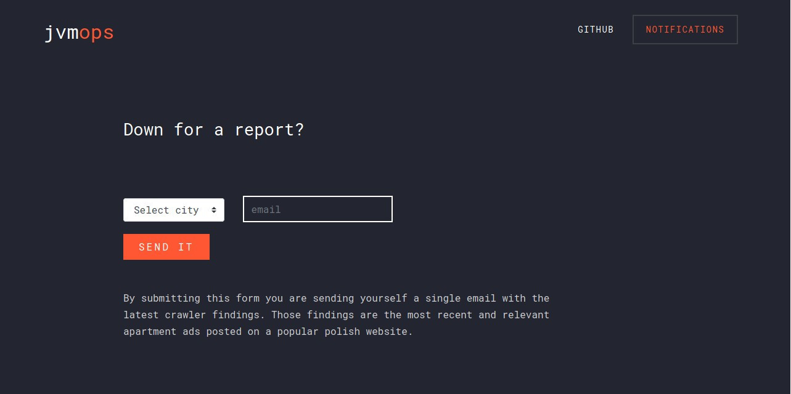

<h1 align="center">
  gumtree-scraper<br>
  <a href="https://github.com/jvmops/gumtree-scraper/actions"></a>
  <a href="https://codecov.io/gh/jvmops/gumtree-scraper"></a>
  <a href="https://github.com/jvmops/gumtree-scraper/blob/master/LICENSE"></a>
  <br><br>
</h1>

Polish private rental apartment market is established around gumtree. Ads are displayed based on creation time (newest first). The main issue here is that most of these ads are re-posted every day in order for them to show up on top of the list. From the user perspective it kind of sux because you need to get through many ads before you find the ones introduced today...



This app solves that problem. It scrap ads, watch for duplicated offers and gather those data. Daily report with interesting findings is distributed to the concerned parties via a gmail account.

Demo: https://gumtree.jvmops.com

## Building from sources:
Requirements:
- JDK 14
- docker

```
git clone https://github.com/jvmops/gumtree-scraper.git
cd gumtree-scraper
./gradlew build
docker build -t jvmops/gumtree-scraper .
```

## Running
Requirements:
- docker-compose

Docker image is available at [docker hub](https://hub.docker.com/r/jvmops/gumtree-scraper). Building from sources is not required to run this app.
```
git clone https://github.com/jvmops/gumtree-scraper.git
cd gumtree-scraper
docker-compose up -d
```
Now go to: http://localhost:8080

## Scrapping
Scrapping is done by a separate container. It's best to run this command by a crontab.
```
docker start gumtree-scraper
```
